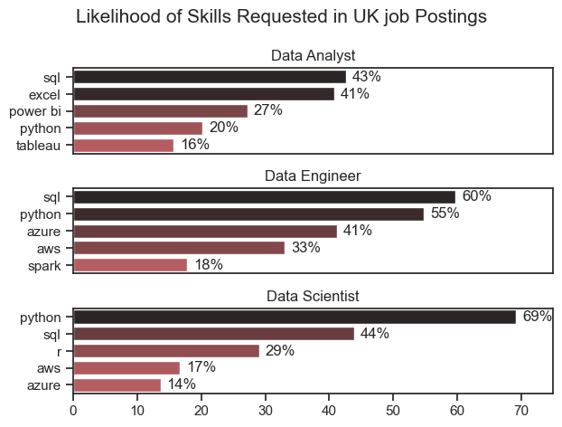
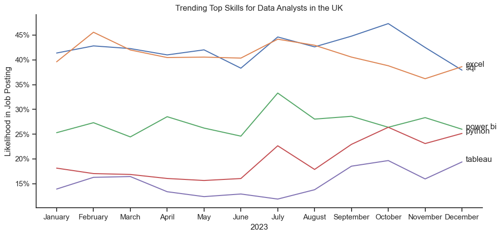

# Overview
This analysis of the data job market focuses on data analyst roles. It was initiated to better understand the job market and identify top-paying and in-demand skills, thereby aiding in the search for optimal job opportunities for data analysts.

The data, sourced from [Luke Barousse's Python Course](https://github.com/lukebarousse/Python_Data_Analytics_Course), provides a comprehensive foundation for the analysis, including job titles, salaries, locations, and essential skills. Through a series of Python scripts, key questions are explored, such as the most demanded skills, salary trends, and the intersection of demand and salary in data analytics.

# The Questions

Below are the questions I want to answer in my project:

1. What are the most demanded skills for the top 3 most popular data science roles in the UK? 
2. How are in-demand skills trending for Data Analysts in the UK?
3. How well do jobs and skills pay for Data Analysts?
4. What are the optimal skills for data analysts to learn? (High Demand AND High Paying)

# Tools Used

### Tools I Used

For an in-depth analysis of the data analyst job market, I utilised several key tools:

- **Python**: The backbone of my analysis, enabling data analysis and critical insights. Specific Python libraries used include:
  - **Pandas Library**: For data analysis.
  - **Matplotlib Library**: For data visualisation.
  - **Seaborn Library**: For creating advanced visuals.
- **Jupyter Notebooks**: Used to run Python scripts, facilitating the inclusion of notes and analysis.
- **Visual Studio Code**: My preferred tool for executing Python scripts.
- **Git & GitHub**: Essential for version control and sharing Python code and analysis, ensuring collaboration and project tracking.

# Data Preparation and Cleanup

This section outlines the steps taken to prepare the data for analysis, ensuring accuracy and usability.

#### Import & Clean Up Data

I begin by importing the necessary libraries and loading the dataset. This is followed by initial data cleaning tasks to ensure data quality.

```python
# import libararies
import pandas as pd
from datasets import load_dataset
import matplotlib.pyplot as plt
import ast
import seaborn as sns

# load data
dataset = load_dataset('lukebarousse/data_jobs')
df = dataset['train'].to_pandas()

# data cleanup
df['job_posted_date'] = pd.to_datetime(df['job_posted_date'])
df['job_skills'] = df['job_skills'].apply(lambda x: ast.literal_eval(x) if pd.notna(x) else x)

```

# Filter UK Jobs

```python
df_UK = df[df['job_country'] == 'United Kingdom']
```
To focus my analysis on the UK job market, I applied filters to the dataset, narrowing it down to roles based in the.

# The Analysis

## 1. What are the most demanded skills for the top 3 most popular data science roles in the UK? 

To identify the most in-demand skills for the top three popular data roles, I filtered the job positions to determine the most prevalent roles. Subsequently, I extracted the top five skills for each of these roles. This analysis reveals the most popular job titles and their essential skills, providing guidance on which competencies to prioritize based on the targeted role.

View my notebook with detailed steps here: [2_skill_demand_Analysis](Data_science_project_py/Analysis/2_Skills_Demand_Analysis.ipynb)

### Visualise Data

```python
fig, ax = plt.subplots(len(job_titles), 1)

for i, job_title in enumerate(job_titles):
    df_plot = df_skills_perc[df_skills_perc['job_title_short'] == job_title].head(5)
    
    sns.barplot(
        data=df_plot,
        x='skill_percent',
        y='job_skills',
        ax=ax[i],
        hue='skill_count',
        palette='dark:r_r'
    )
    
plt.show()
```
### Results



### Insights

* **SQL and Python**: These two skills are highly sought after across all three roles, reflecting their foundational importance in data-related jobs.
* **Excel and Power BI**: These tools are particularly relevant for Data Analyst roles, highlighting the focus on business analytics and reporting.
* **Cloud Platforms (Azure and AWS)**: These skills are critical for Data Engineer roles, emphasizing the need for cloud infrastructure knowledge.
* **Tableau**: While important for Data Analysts, it's not as prominently required for Data Engineers or Data Scientists.
* **Spark**: Specifically relevant for Data Engineers, indicating the importance of big data processing in this role.

This analysis shows the varying importance of different skills across these roles, with some skills being universally important (like SQL and Python) and others being more role-specific (like Excel for Data Analysts and Spark for Data Engineers).

## 2. How are in-demand skills trending for Data Analysts in the UK?

To analyse skill trends for Data Analysts in 2023, I filtered job postings for data analyst positions and grouped the required skills by month. This process identified the top five skills for data analysts on a monthly basis, illustrating their popularity throughout the year.

View my notebook with detailed steps here: [3_Skills_Trend](Data_science_project_py/Analysis/3_Skills_Trend.ipynb)

### Visualise Data

```python
from matplotlib.ticker import PercentFormatter

df_plot = df_da_uk_perc.iloc[:, :5]
sns.lineplot(data=df_plot, dashes=False)

ax = plt.gca()
ax.yaxis.set_major_formatter(PercentFormatter(decimals=0))

plt.show()
```
### Results


*Bar graph visualising the trending top skills for data analysts in the UK in 2023*

### Insights
* **Consistency in Demand**: SQL and Excel are consistently the top two skills in demand for Data Analysts, indicating their fundamental importance.
* **Seasonal Peaks**: There are noticeable peaks in the demand for all skills around mid-year (July-August), which could correspond to specific industry cycles or project timelines.
* **Stable Skill Set Requirements**: The skills in demand do not change drastically over the year, suggesting a stable set of core competencies required for Data Analysts in the UK.

This analysis shows the persistent importance of SQL and Excel for Data Analysts, with Power BI, Python, and Tableau also being significant but to varying extents. The trends suggest a stable demand for these skills with seasonal variations.
