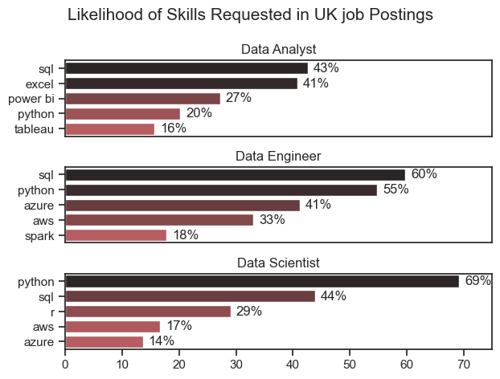
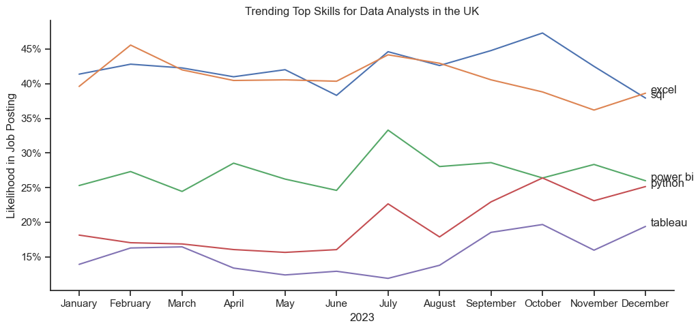
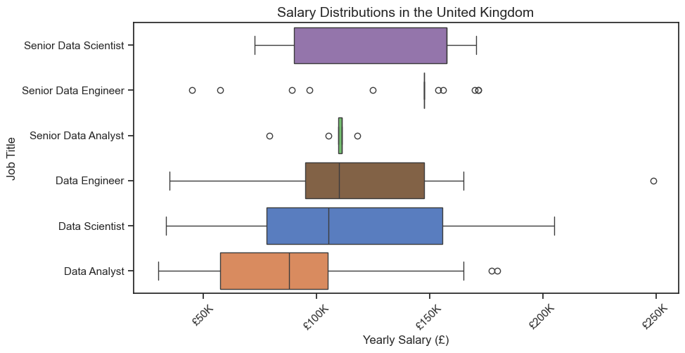
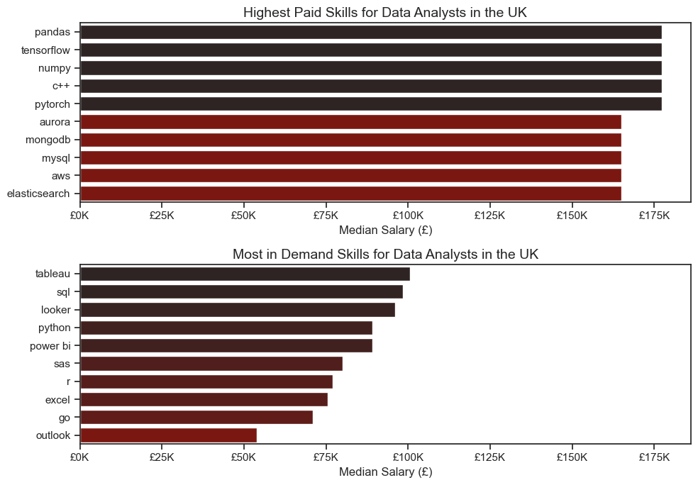
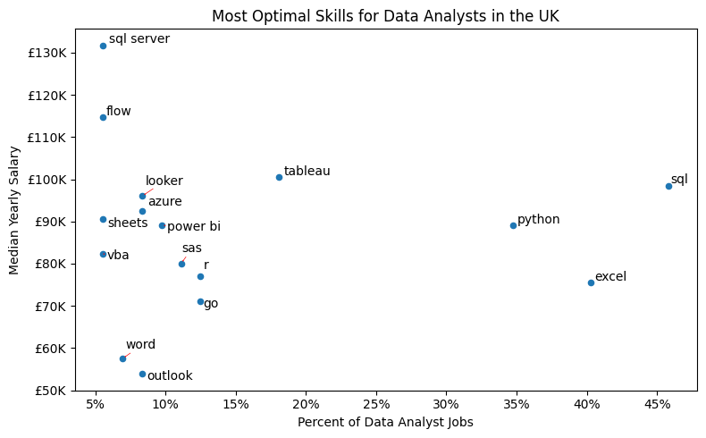
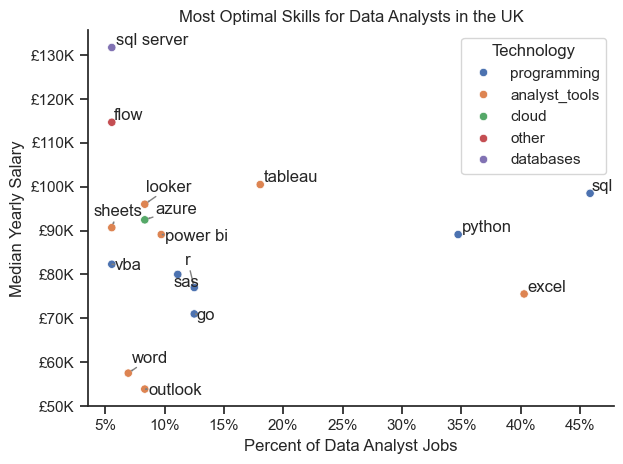

# Overview
This analysis of the data job market focuses on data analyst roles. It was initiated to better understand the job market and identify top-paying and in-demand skills, thereby aiding in the search for optimal job opportunities for data analysts.

The data, sourced from [Luke Barousse's Python Course](https://github.com/lukebarousse/Python_Data_Analytics_Course), provides a comprehensive foundation for the analysis, including job titles, salaries, locations, and essential skills. Through a series of Python scripts, key questions are explored, such as the most demanded skills, salary trends, and the intersection of demand and salary in data analytics.

# The Questions

Below are the questions I want to answer in my project:

1. What are the most demanded skills for the top 3 most popular data science roles in the UK? 
2. How are in-demand skills trending for Data Analysts in the UK?
3. How well do jobs and skills pay for Data Analysts in the UK?
4. What are the most optimal skills to learn for Data Analysts in the UK? (High Demand AND High Paying)

# Tools Used

### Tools I Used

For an in-depth analysis of the data analyst job market, I utilised several key tools:

- **Python**: The backbone of my analysis, enabling data analysis and critical insights. Specific Python libraries used include:
  - **Pandas Library**: For data analysis.
  - **Matplotlib Library**: For data visualisation.
  - **Seaborn Library**: For creating advanced visuals.
- **Jupyter Notebooks**: Used to run Python scripts, facilitating the inclusion of notes and analysis.
- **Visual Studio Code**: My preferred tool for executing Python scripts.
- **Git & GitHub**: Essential for version control and sharing Python code and analysis, ensuring collaboration and project tracking.

# Data Preparation and Cleanup

This section outlines the steps taken to prepare the data for analysis, ensuring accuracy and usability.

#### Import & Clean Up Data

I begin by importing the necessary libraries and loading the dataset. This is followed by initial data cleaning tasks to ensure data quality.

```python
# import libararies
import pandas as pd
from datasets import load_dataset
import matplotlib.pyplot as plt
import ast
import seaborn as sns

# load data
dataset = load_dataset('lukebarousse/data_jobs')
df = dataset['train'].to_pandas()

# data cleanup
df['job_posted_date'] = pd.to_datetime(df['job_posted_date'])
df['job_skills'] = df['job_skills'].apply(lambda x: ast.literal_eval(x) if pd.notna(x) else x)

```

# Filter UK Jobs

```python
df_UK = df[df['job_country'] == 'United Kingdom']
```
To focus my analysis on the UK job market, I applied filters to the dataset, narrowing it down to roles based in the.

# The Analysis

## 1. What are the most demanded skills for the top 3 most popular data science roles in the UK? 

To identify the most in-demand skills for the top three popular data roles, I filtered the job positions to determine the most prevalent roles. Subsequently, I extracted the top five skills for each of these roles. This analysis reveals the most popular job titles and their essential skills, providing guidance on which competencies to prioritize based on the targeted role.

View my notebook with detailed steps here: [2_skill_demand_Analysis](Data_science_Job_Analysy-w-Python/Analysis/2_Skills_Demand_Analysis.ipynb)

### Visualise Data

```python
fig, ax = plt.subplots(len(job_titles), 1)

for i, job_title in enumerate(job_titles):
    df_plot = df_skills_perc[df_skills_perc['job_title_short'] == job_title].head(5)
    
    sns.barplot(
        data=df_plot,
        x='skill_percent',
        y='job_skills',
        ax=ax[i],
        hue='skill_count',
        palette='dark:r_r'
    )
    
plt.show()
```
### Results



### Insights

* **SQL and Python**: These two skills are highly sought after across all three roles, reflecting their foundational importance in data-related jobs.
* **Excel and Power BI**: These tools are particularly relevant for Data Analyst roles, highlighting the focus on business analytics and reporting.
* **Cloud Platforms (Azure and AWS)**: These skills are critical for Data Engineer roles, emphasizing the need for cloud infrastructure knowledge.
* **Tableau**: While important for Data Analysts, it's not as prominently required for Data Engineers or Data Scientists.
* **Spark**: Specifically relevant for Data Engineers, indicating the importance of big data processing in this role.

This analysis shows the varying importance of different skills across these roles, with some skills being universally important (like SQL and Python) and others being more role-specific (like Excel for Data Analysts and Spark for Data Engineers).

## 2. How are in-demand skills trending for Data Analysts in the UK?

To analyse skill trends for Data Analysts in 2023, I filtered job postings for data analyst positions and grouped the required skills by month. This process identified the top five skills for data analysts on a monthly basis, illustrating their popularity throughout the year.

View my notebook with detailed steps here: [Data_science_Job_Analysy-w-Python/Analysis/3_Skills_Trend.ipynb)

### Visualise Data

```python
from matplotlib.ticker import PercentFormatter

df_plot = df_da_uk_perc.iloc[:, :5]
sns.lineplot(data=df_plot, dashes=False)

ax = plt.gca()
ax.yaxis.set_major_formatter(PercentFormatter(decimals=0))

plt.show()
```
### Results


*Bar graph visualising the trending top skills for data analysts in the UK in 2023*

### Insights
* **Consistency in Demand**: SQL and Excel are consistently the top two skills in demand for Data Analysts, indicating their fundamental importance.
* **Seasonal Peaks**: There are noticeable peaks in the demand for all skills around mid-year (July-August), which could correspond to specific industry cycles or project timelines.
* **Stable Skill Set Requirements**: The skills in demand do not change drastically over the year, suggesting a stable set of core competencies required for Data Analysts in the UK.

This shows the persistent importance of SQL and Excel for Data Analysts, with Power BI, Python, and Tableau also being significant but to varying extents. The trends suggest a stable demand for these skills with seasonal variations.

# 3. How well do jobs and skills pay for Data Analysts in the UK?

To identify the highest-paying roles and skills, I focused on jobs in the UK and analysed their median salaries. Initially, I examined the salary distributions of common data roles such as Data Scientist, Data Engineer, and Data Analyst to understand which jobs offer the highest pay.

View my notebook with detailed steps here: [Data_science_Job_Analysy-w-Python/Analysis/4_salary_analysis.ipynb)

### Visualise Data

```python
sns.boxplot(data=df_uk_top6, x='salary_year_avg', y='job_title_short',order=job_order)

ax = plt.gca()
ax.xaxis.set_major_formatter(plt.FuncFormatter(lambda x, pos: f'£{int(x/1000)}K'))

plt.show()
```
### Results


### Insights
* **Salary Hierarchy**: Senior roles (Senior Data Scientist, Senior Data Engineer) command significantly higher salaries compared to mid-level roles (Data Scientist, Data Engineer, Senior Data Analyst) and entry-level roles (Data Analyst).
* **Variability**: Senior roles exhibit greater variability in salaries, likely reflecting differences in company size, industry, and individual expertise.
* **Outliers**: The presence of high outliers in Senior roles suggests that exceptional performers or those in high-demand areas can earn significantly above the median.
* **Career Progression**: There is a clear financial progression from Data Analyst to more senior and specialised roles, highlighting the potential for salary growth with experience and advanced skills.

This analysis helps understand the financial landscape for various data-related roles in the UK, emphasizing the value of advanced skills and seniority in achieving higher compensation.

### Highest Paid & Most Demanded Skills for Data Analysts in the UK

Next, I narrowed my analysis to focus exclusively on data analyst roles. I examined the highest-paid and most in-demand skills, presenting these findings using two bar charts.

```python
fig, ax = plt.subplots(2, 1)

sns.barplot(data=df_DA_UK_top_pay, x='median', y=df_DA_UK_top_pay.index, ax=ax[0], hue='median', palette='dark:r_r')

sns.barplot(data=df_DA_UK_skills, x='median', y=df_DA_UK_skills.index, ax=ax[1], hue='median', palette='dark:r_r')

plt.show()
```
### Results

*Two seperate bar graphs visualising the highest paid skills and most in demand skills for Data Analysts in the UK*

### Insights

* **High-Paying vs. High-Demand Skills**: There is a distinction between the highest-paid skills and the most in-demand skills. Skills like Pandas, TensorFlow, and PyTorch command high salaries, indicating their advanced and specialised nature, particularly in machine learning and data manipulation. In contrast, skills like SQL, Tableau, and Excel are highly in demand, highlighting their foundational and widespread use in data analysis tasks.
* **Specialisation vs. Generalisation**: High-paying skills often reflect specialised expertise (e.g., machine learning frameworks, advanced programming), whereas high-demand skills are more generalised and essential for day-to-day data analysis work.
* **Emerging Technologies**: The presence of tools like Looker and Power BI in the most in-demand list suggests a shift towards modern data exploration and business intelligence tools.

This provides a comprehensive view of the current landscape for Data Analysts in the UK, indicating which skills are most lucrative and which are most sought after in job postings.

# 4. What are the most optimal skills to learn for Data Analysts in the UK?

To identify the most optimal skills to learn (those that are both the highest paid and in highest demand), I calculated the percentage of skill demand and the median salary for these skills. This approach helps easily determine the most beneficial skills to acquire.

View my notebook with detailed steps here: [Optimal_skills](Data_science_Job_Analysy-w-Python/Analysis/5_optimal_skill.ipynb)

### Visualise Data
```python
from adjustText import adjust_text
from matplotlib.ticker import PercentFormatter

df_da_skills_high_demand.plot(kind='scatter', x='skill_percent', y='median_salary')

plt.show()
```
### Results

*A scatter plot visualising the most optimal skills for Data Analysts in the UK*

### Visualising Different Technologies

Next, I aimed to visualise the different technologies in the graph by adding colour based on the technology.

```python
from adjustText import adjust_text
from matplotlib.ticker import PercentFormatter

sns.scatterplot(
    data=df_DA_skills_tech_high_demand,
    x='skill_percent',
    y='median_salary',
    hue='technology',
)

plt.show()
```
### Results

### Insights

* **High Salary and Low Demand**: Skills like SQL Server and Flow command high salaries despite being less frequently required. This suggests a high value placed on niche expertise.
* **High Salary and Moderate Demand**: Tableau, Looker, and Azure are skills that balance high salaries with moderate demand, making them highly beneficial for data analysts to learn.
* **High Demand and High Salary**: Python and SQL are both highly in demand and offer high salaries, underscoring their critical importance in the data analytics field.
* **High Demand and Moderate Salary**: Excel remains in high demand, but its salary is relatively moderate compared to other skills, reflecting its status as a ubiquitous tool.

This scatter plot helps in understanding which skills offer the best combination of high salary and demand, guiding data analysts on where to focus their skill development efforts.

# What I Learned

Throughout this project, I enhanced my understanding of the data analyst job market and developed my technical proficiency in Python, particularly in data manipulation and visualisation. The key insights gained include:

- **Advanced Python Utilisation**: Employing libraries such as Pandas for data manipulation, Seaborn and Matplotlib for data visualisation, and additional Python libraries facilitated the execution of complex data analysis tasks with greater efficiency.
- **Significance of Data Cleaning**: The importance of meticulous data cleaning and preparation was highlighted, as these processes are essential for ensuring the accuracy and reliability of the analytical insights derived from the dataset.
- **Strategic Skill Alignment**: This project underscored the necessity of aligning technical skills with market demand. Comprehending the interplay between skill demand, salary trends, and job availability is critical for informed and strategic career planning within the technology sector.

# Insights

This project provided several general insights into the data job market for analysts:

- **Correlation Between Skill Demand and Salary**: A clear correlation exists between the demand for specific skills and the salaries commanded by these skills. Advanced and specialised skills such as Python and Oracle often correlate with higher salaries.
- **Market Trends**: There are dynamic trends in skill demand, underscoring the evolving nature of the data job market. Staying informed about these trends is crucial for career advancement in data analytics.
- **Economic Value of Skills**: Understanding which skills are both in demand and well-compensated can guide data analysts in prioritising their learning efforts to maximise economic returns.

# Challenges I Faced

This project presented several challenges that offered valuable learning experiences:

- **Data Inconsistencies**: Addressing missing or inconsistent data entries necessitated meticulous data-cleaning procedures to preserve the integrity and reliability of the analysis.
- **Complex Data Visualisation**: Creating effective visual representations of intricate datasets was a significant challenge, essential for clearly and compellingly communicating insights.
- **Balancing Breadth and Depth**: Striking a balance between in-depth analysis and maintaining a comprehensive overview of the data landscape required careful consideration to ensure thorough coverage without losing focus on key details.

# Conclusion
This exploration of the data analyst job market has been highly informative, elucidating the critical skills and trends that define this evolving field. The insights gained have enhanced my understanding and provide actionable guidance for individuals seeking to advance their careers in data analytics. As the market continues to evolve, ongoing analysis will be essential to remain at the forefront of data analytics. This project establishes a robust foundation for future explorations and underscores the importance of continuous learning and adaptation in the data field.
